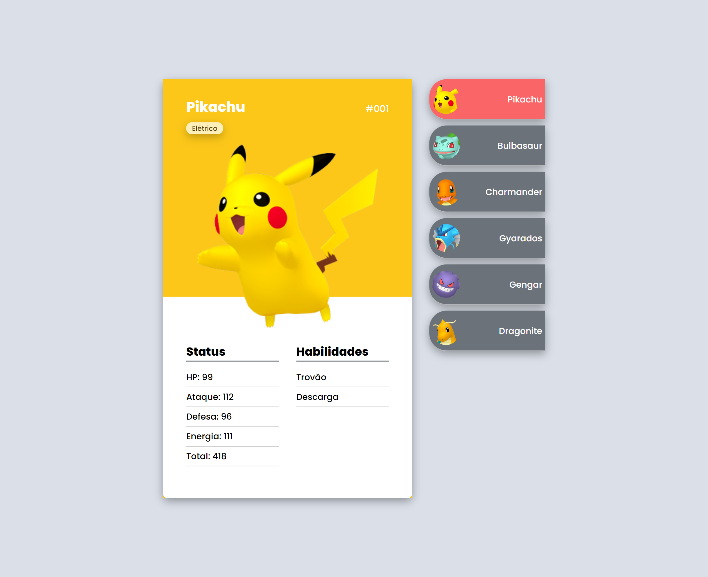

# PROJETO POKEDEX

Projeto criando no evento MapaDEVweek, onde foi desenvolvido uma página web com Cards de Pokemon. O usuário consegue escolher entre os cards, selecionar e obter informações sobre os Pokemons.

[Clique aqui para acessar](melissabilher.github.io/pokedex/)

## 🛠 Tecnologias

- HTML
- CSS
- JavaScript
- Git e Github
